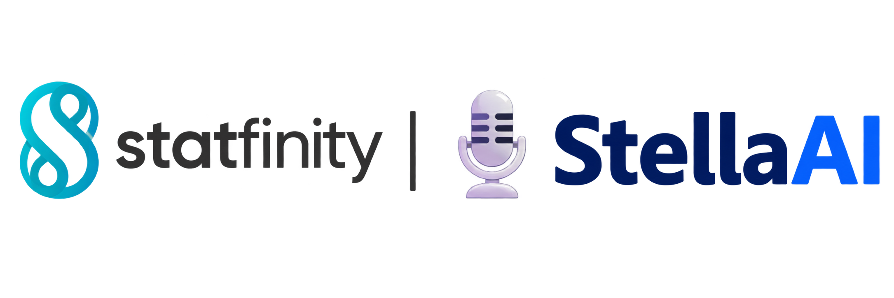
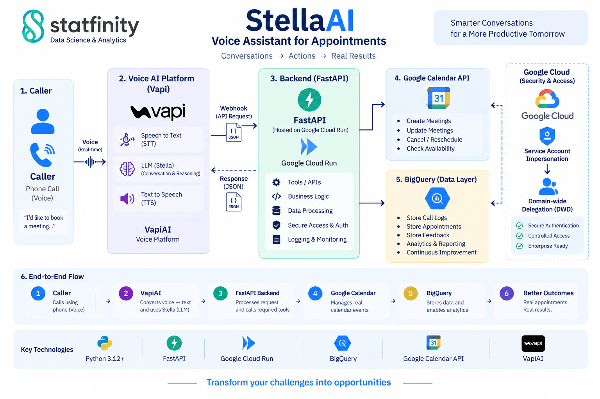

<div align="center">

<a href="https://statfinity.in/">
  
</a>

### The AI voice agent that answers the phone — and actually gets things done.

**Real appointments. Real Calendar events. Zero humans required.**

[](.)
[](.)
[](.)
[](.)
[](.)
[](.)

[**Statfinity**](https://statfinity.in/) | [**LinkedIn**](https://in.linkedin.com/company/statfinity)

</div>

---


Built by **Statfinity**. Meet **StellaAI** — a voice agent that doesn't just talk, it *acts*: checks real calendars, books real events, and keeps a fully auditable record of every call.

## 📞 What StellaAI Does

| | Capability |
|---|---|
| 📅 | **Schedules appointments** — checks live availability, books a real Calendar event with a Meet link |
| 🔍 | **Checks a specific time** — "is 3pm on the 15th free?" |
| 🗓️ | **Browses open slots** — "what's available this week?" |
| 🔄 | **Reschedules in place** — same event, same Meet link, no cancel-and-rebook |
| ❌ | **Cancels** — even when the caller can't remember the date |
| 💬 | **Logs feedback** — routed straight to the team |

No simulated actions anywhere in this system. Every booking is a real Calendar event. Every record lives in BigQuery, queryable and auditable.

## 🏗️ Architecture



---

### Request flow

```text
Caller
  │
  ▼
VapiAI Voice Assistant
  │
  │ HTTPS tool/webhook request
  ▼
FastAPI Backend — Google Cloud Run
  │
  ├── Appointment logic
  │      ├── Availability / conflict detection
  │      ├── Schedule
  │      ├── Find
  │      ├── Cancel
  │      └── Reschedule
  │
  ├── Google Calendar API
  │      └── Calendar events + Google Meet
  │
  └── BigQuery
         └── Appointment + complaint records
```

## 🧩 Project Structure

```text
stellaai/
├── backend.py                            # FastAPI application and API endpoints
├── bq_database.py                        # BigQuery queries and appointment persistence
├── calendar_service.py                   # Google Calendar / Google Meet integration
├── email_processor.py (Optional)         # Email normalization and verification workflow
├── hooks_payload.json                    # Vapi assistant/webhook configuration payload
├── logging_config.py                     # Application logging configuration
├── mailbox_verifier.py (Optional)        # Mailbox verification integration
├── settings.py                           # Environment-based configuration
├── Dockerfile                            # Container image definition
├── pyproject.toml                        # Python/UV project configuration
├── requirements.txt                      # Runtime dependencies
├── requirements_list.txt                 # Dependency reference/list
├── uv.lock                               # Reproducible UV dependency lock
├── README.md                             # Project documentation
└── docs/
    └── architecture-overview.png
```

## 📦 Core Modules

**`backend.py`**  
Exposes the FastAPI endpoints, validates Vapi webhook requests, orchestrates appointment operations, and connects the API layer to BigQuery and Google Calendar.

**`bq_database.py`**  
Stores appointments and complaints, finds existing appointments, detects conflicts, and updates/cancels appointment records.

**`calendar_service.py`**  
Creates, updates, and deletes Google Calendar events and creates Google Meet conference data.

**`email_processor.py` / `mailbox_verifier.py` (Optional)**  
Handle email normalization and mailbox verification.

**`settings.py`**  
Loads deployment configuration from environment variables rather than hard-coding application settings.

**`hooks_payload.json`**  
Contains the payload used to configure/update the Vapi assistant integration.

---

## 🔧 VapiAI Tools

The current StellaAI assistant uses these Vapi tool actions:

| Tool | Purpose |
|---|---|
| `check_availability` | Check whether one requested date/time is free |
| `available_slots` | Find free windows across a requested date |
| `schedule_appointment` | Create the appointment after availability is confirmed |
| `find_appointments` | Find active appointments using the caller's phone/date |
| `cancel_appointment` | Cancel one confirmed appointment |
| `reschedule_appointment` | Move an existing appointment to a new time |
| `note_complaint_request` | Record caller feedback/complaints |
| `process_email` | Validate/process an email address when required | (Optional)


## 🔄 Conversation & Tool Flows

StellaAI follows structured conversation flows to turn caller intent into the right backend action.

| Flow | Conversation → Action |
|---|---|
| 📅 **Schedule** | `Name → Reason → Date & Time → Confirm → Check → Book` |
| 🔎 **Availability** | `Date & Time → Confirm → Check → Available → Book?` |
| 🕐 **Available Slots** | `Date → Find Slots → Offer Slot → Select → Book` |
| ❌ **Cancel** | `Identify → Find → Confirm → Reason → Cancel` |
| 🔄 **Reschedule** | `Identify → New Date & Time → Check → Confirm → Reschedule` |
| 💬 **Feedback** | `Name → Feedback → Record` |

> **One conversation. One active flow. One action at a time.**  
> StellaAI preserves confirmed context, validates availability before changes, and connects each conversation to the appropriate backend action.

---

# ☁️ Google Cloud Setup

## Required Google APIs


Enable the APIs required by the deployment:

```text
Cloud Run API
Cloud Build API
BigQuery API
Google Calendar API
IAM API
Service Usage API
```

Example:
```bash
gcloud services enable \
  run.googleapis.com \
  cloudbuild.googleapis.com \
  bigquery.googleapis.com \
  calendar-json.googleapis.com \
  iam.googleapis.com \
  serviceusage.googleapis.com
```

---


## Service Account

Create a dedicated service account for the voice-agent backend.

Example placeholder:

```text
SERVICE_ACCOUNT=statai-voiceagent@PROJECT_ID.iam.gserviceaccount.com
```

---

## IAM Permissions

Because the application reads and writes appointment and complaint data, the
runtime service account Required access.

```text
BigQuery Job User
roles/bigquery.jobUser

Cloud Run Admin
roles/run.admin

Service Account User
roles/iam.serviceAccountUser

Artifact Registry Reader
roles/artifactregistry.reader

Service Account Token Creator
roles/iam.serviceAccountTokenCreator
```

---

## Google Workspace Domain-Wide Delegation (DWD) Setup

Google Calendar access uses **Domain-wide Delegation** so the service account can act on behalf of a Workspace user.

> DWD configuration is an **Admin Console** operation and must be completed by a Google Workspace administrator.

## Steps

1. Create/select the target service account.
2. Enable **Domain-wide Delegation** for that service account.
3. Copy the service account's **OAuth 2.0 Client ID**.
4. In Google Workspace Admin Console, open the API controls for Domain-wide Delegation.
5. Add the service account client ID.
6. Add the OAuth scopes used by the application.

### Required Calendar scopes
```text
https://www.googleapis.com/auth/calendar
https://www.googleapis.com/auth/calendar.events
```

---

# 💻 Development

## 1. Clone the repository

```bash
git clone https://github.com/shantanu-j/Vapi-Voice-Agent.git
cd Vapi-Voice-Agent
```

## 2. Install UV

If UV is not already installed:

```bash
pip install uv
```

## 3. Create the virtual environment

```bash
uv venv
```

Activate it on Windows:

```powershell
.venv\Scripts\activate
```

Activate it on macOS/Linux:

```bash
source .venv/bin/activate
```

## 4. Install dependencies

For a UV-managed project:

```bash
uv sync
```

## 5. Authenticate with Google Cloud

```bash
gcloud auth login
gcloud auth application-default login
```

Select the project:

```bash
gcloud config set project <PROJECT_ID>
```

## 6. Configure environment variables

Set the required `.env`/shell configuration.

```env
PROJECT_ID
DATASET_ID
APPOINTMENTS_TABLE_ID
COMPLAINTS_TABLE_ID
TARGET_SERVICE_ACCOUNT
DELEGATED_USER
VAPI_SERVER_SECRET=your-vapi-server-secret
QUICKEMAILVERIFICATION_API_KEY (Optional)
```


# 🚀 Deployment

### Local

Run the application locally using Uvicorn:

```bash
uv run uvicorn backend:app --host 0.0.0.0 --port 8080
```

### Google Cloud

Build the Docker image and deploy the application to Google Cloud Run:

```bash
gcloud builds submit --tag gcr.io/<PROJECT_ID>/stataivoicev1-bot

gcloud run deploy stataivoicev1-bot \
  --image gcr.io/<PROJECT_ID>/stataivoicev1-bot \
  --platform managed \
  --region us-central1
```
Configure the required environment variables and secrets in the Cloud Run service.


---

# 📦 Technology Stack

| Layer | Technology |
|---|---|
| Voice AI | VapiAI |
| LLM / conversation engine | Configured through VapiAI |
| Backend | Python + FastAPI |
| Validation | Pydantic |
| Runtime | Uvicorn |
| Package management | UV |
| Container | Docker |
| Build | Google Cloud Build |
| Hosting | Google Cloud Run |
| Database | Google BigQuery |
| Calendar | Google Calendar API |
| Meetings | Google Meet via Calendar API |
| Authentication | Google service-account impersonation |
| Workspace access | Domain-wide Delegation |
| Email verification (Optional) | QuickEmailVerification |
| Logging | Python logging configuration |

---


# 📌 API Surface

```text

POST /check_availability/
POST /available_slots/
POST /schedule_appointment/
POST /find_appointments/
POST /cancel_appointment/
POST /note_complaint_request/
POST /reschedule_appointment/
```

Protected Vapi endpoints use the webhook secret dependency.

---

# 🧪 Suggested End-to-End Test Plan

### Scheduling

```text
Caller → Book appointment
       → Give name
       → Give reason
       → Give date/time/timezone
       → Confirm
       → Availability check
       → Appointment created
       → Calendar event created
       → BigQuery record created
```

### Available Slots

```text
Caller → Ask what times are available
       → Date
       → Available Slots
       → Offer first available slot
       → Ask for more options or booking
       → Select slot
       → Book
```

### Availability → Booking

```text
Caller → Ask for a specific time
       → Confirm
       → Check availability
       → "Would you like to book it?"
       → Book without re-checking the same slot
```

### Rescheduling

```text
Caller → Identify appointment
       → Give new date/time
       → Availability check
       → Confirm
       → Update same Calendar event
       → Update same BigQuery appointment
```

### Cancellation

```text
Caller → Identify appointment
       → Find appointment
       → Confirm correct appointment
       → Give cancellation reason
       → Calendar event deleted
       → BigQuery record marked canceled
```

### Feedback / Complaint

```text
Caller → Name
       → Issue / Feedback
       → Record
```

---

# 🚀 Future Extension Points

The architecture can be extended without changing the core voice experience:

- Lead capture
- Customer lookup
- Automated follow-up
- SMS/email notifications
- Additional Google Workspace services
- Analytics dashboards
- Multiple business calendars
- Additional Vapi tools
- MCP-based integrations where appropriate
- Human-agent escalation
- Advanced appointment rules and working hours

---

# 📚 Useful References

- [VapiAI](https://vapi.ai/)
- [Vapi Documentation](https://docs.vapi.ai/)
- [Google Cloud Run](https://cloud.google.com/run)
- [Google Cloud Build](https://cloud.google.com/build)
- [BigQuery](https://cloud.google.com/bigquery)
- [Google Calendar API](https://developers.google.com/calendar/api)
- [FastAPI](https://fastapi.tiangolo.com/)
- [UV](https://docs.astral.sh/uv/)

---

## License

**StellaAI · Statfinity**  
*Empower Your Business with Data Science and Analytics*